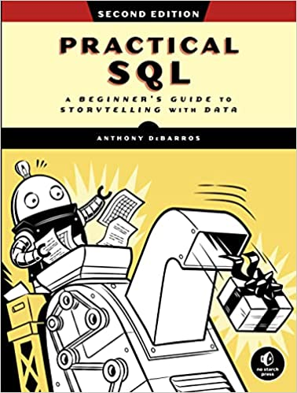

# Practical SQL
A Beginner's Guide to Storytelling with Data

>Anthony DeBarros

## [Book info](https://nostarch.com/practical-sql-2nd-edition/)
[Github link for code](https://github.com/anthonydb/practical-sql-2/)

Practical SQL is an approachable and fast-paced guide to SQL (Structured Query Language), the standard programming language for defining, organizing, and exploring data in relational databases. Anthony DeBarros, a journalist and data analyst, focuses on using SQL to find the story within your data. The examples and code use the open-source database PostgreSQL and its companion pgAdmin interface, and the concepts you learn will apply to most database management systems, including MySQL, Oracle, SQLite, and others.*

You’ll first cover the fundamentals of databases and the SQL language, then build skills by analyzing data from real-world datasets such as US Census demographics, New York City taxi rides, and earthquakes from US Geological Survey. Each chapter includes exercises and examples that teach even those who have never programmed before all the tools necessary to build powerful databases and access information quickly and efficiently.

You’ll learn how to:
- Create databases and related tables using your own data
- Aggregate, sort, and filter data to find patterns
- Use functions for basic math and advanced statistical operations
- Identify errors in data and clean them up
- Analyze spatial data with a geographic information system (PostGIS)
- Create advanced queries and automate tasks

## Table of Contents
- Chapter 1: Setting Up Your Coding Environment
- Chapter 2: Creating Your First Database and Table
- Chapter 3: Beginning Data Exploration with SELECT
- Chapter 4: Understanding Data Types
- Chapter 5: Importing and Exporting Data
- Chapter 6: Basic Math and Stats with SQL
- Chapter 7: Joining Tables in a Relational Database
- Chapter 8: Table Design That Works for You
- Chapter 9: Extracting Information by Grouping and Summarizing
- Chapter 10: Inspecting and Modifying Data
- Chapter 11: Statistical Functions In SQL
- Chapter 12: Working With Dates and Times
- Chapter 13: Advanced Query Techniques
- Chapter 14: Mining Text to Find Meaningful Data
- Chapter 15: Analyzing Spatial Data with PostGIS
- Chapter 16: Working With JSON Data
- Chapter 17: Saving Time with Views, Functions, and Triggers
- Chapter 18: Using PostgreSQL from the Command Line
- Chapter 19: Maintaining Your Database
- Chapter 20: Telling Your Data's Story
- Appendix: Additional PostgreSQL Resources